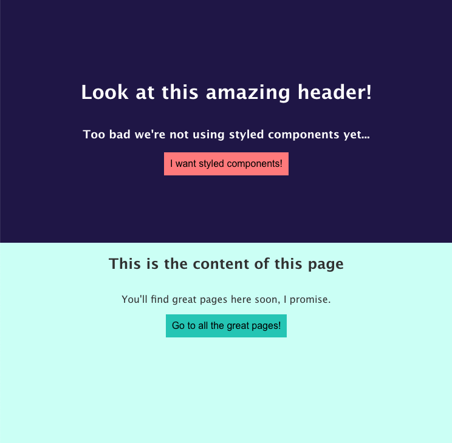

This project was bootstrapped with [Create React App](https://github.com/facebook/create-react-app).

## Available Scripts

In the project directory, you can run:

### `npm install` and `npm start`

Runs the app in the development mode. 
Open [http://localhost:3000](http://localhost:3000) to view it in the browser.

The page will reload if you make edits. 
You will also see any lint errors in the console.

## Opdrachtbeschrijving

1. Implementeer `styled-components` in dit project
2. Vervang de huidige CSS in App.css door lokale styling in de componenten
3. Zorg dat het Button component op basis van de property headerButton andere styling toepast

**Bonus**: Implementeer een GlobalStyle en thema voor de kleuren die gebruikt worden

### What the page should look like

